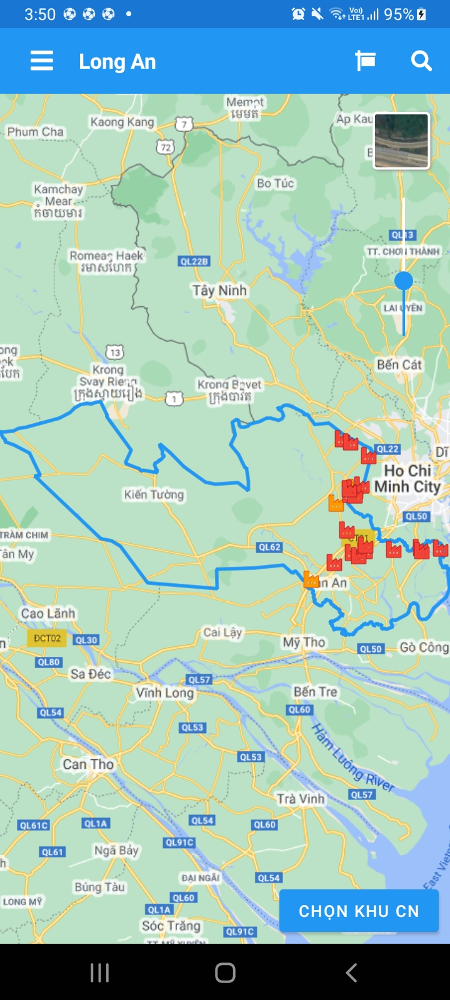
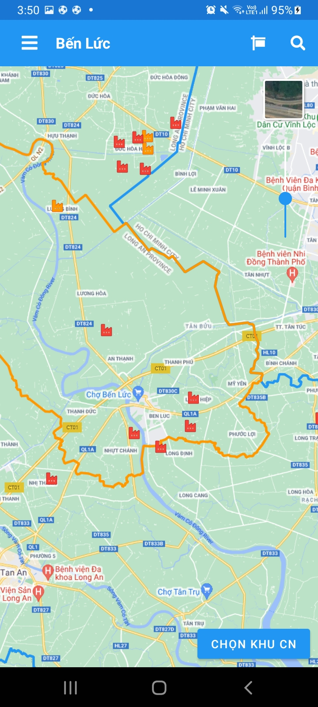

# Ứng dụng tra cứu đất

Dưới đây là danh sách tất cả các tính năng của ứng dụng tra cứu đất. Bên cạnh tính năng tra cứu thửa đất, ứng dụng còn cung cấp các loại bản đồ khác về tài nguyên, môi trường và khu/cụm công nghiệp.

## Bản đồ

Tất cả các bản đồ trong app đều có các tính năng sau:

### Giao diện bản đồ

    
    

### **(1)** Tiêu đề trang

Tiêu đề hiển thị vị trí hiện tại của viewport trên bản đồ, tùy vào loại bản đồ tiêu đề có thể dùng để hiển thị huyện, xã hoặc khu/cụm công nghiệp nếu là bản đồ công nghiệp

### **(2)** Nút quay lại trang chủ chọn bản đồ

### **(3)** Nút hiển thị popup/trang hiện chú thích bản đồ đó

### **(4)** Nút mở trang tìm kiếm nâng cao

Trang tìm kiểm nâng cao dùng để tìm [model](#8-Thực-thể-trên-bản-đồ-model) theo nhiều bộ lọc khác nhau, và nhảy tới vị trí của nó trên bản đồ

### **(5)** Nút hoán đổi basemap giữa street/satellite

### **(6)** Slider thay đổi độ trong suốt bản đồ đất

### **(7)** Nút tùy chỉnh bản đồ

Ở một số bản đồ (thửa đất, công nghiệp), vị trí này sẽ hiện nút nhảy tới các vùng khác nhau trên bản đồ (xã, khu công nghiệp...),
ở một số bản đồ khác (như vài bản đồ môi trường), nút này dùng để [chọn renderer](#Chọn-WQI-để-hiển-thị-trên-bản-đồ) để hiển thị đồ hoạ icon theo các trường khác nhau trong dữ liệu.

### **(8)** Thực thể trên bản đồ (model)

Model là thông tin thực thể mà người dùng có thể xem trên bản đồ. Ở bản đồ đất, được gọi là thửa đất, bản đồ sinh trắc được gọi là điểm đo đạc sinh trắc hay bản đồ hầm đất là khu vực hầm đất.

Người dùng có thể chọn model trên bản đồ để hiển thị thêm thông tin. Nếu muốn tìm kiếm model theo nhiều bộ lọc, người dùng có thể dùng trang tìm kiếm nâng cao.

### **(9)** Snackbar

Snackbar dùng để hiển thị thông tin của model đó.

### **(10)** Hiện biên giới tỉnh Long An

## Danh sách bản đồ

Hiện tại có 7 bản đồ:

* Bản đồ đất
    * [Bản đồ giá đất](#bản-đồ-giá-đất)
    * [Bản đồ khu cụm công nghiệp](#bản-đồ-khu-cụm-công-nghiệp)
* Bản đồ tài nguyên
    * [Bản đồ điểm giếng](#bản-đồ-điểm-giếng)
    * [Bản đồ hầm đất](#bản-đồ-hầm-đất)
* Bản đồ môi trường
    * [Bản đồ quan trắc nước](#bản-đồ-quan-trắc-nước)
    * [Bản đồ quan trắc không khí](#bản-đồ-quan-trắc-không-khí)
    * [Bản đồ trạm xử lý nước thải](#bản-đồ-trạm-xử-lý-nước-thải)

## Bản đồ giá đất

Bản đồ giá đất dùng để tìm kiếm thửa đất ở các huyện/xã trong Long An và hiện thông tin chi tiết về các loại giá cũng như diện tích thửa đất đó.

### Tổng quan bản đồ

    
    
    

### Xem thửa đất

    
    
    

### Xem chi tiết giá đất

    
    
    

### Trang chú thích danh mục đất

    
    
    

### Trang tìm kiếm thửa đất/xã

Người dùng có thể tìm kiếm theo huyện > xã > số tờ > số thửa để nhảy tới thửa đất đó

    
    

## Bản đồ công nghiệp

Viết tắt:
- KCCN: Khu - cụm công nghiệp

### Tổng quan bản đồ

    
    
    

### Xem thửa đất công nghiệp

    
    

### Popup chú thích icon KCCN/thửa đất

### Trang tìm kiếm KCCN/thửa đất

Tìm kiếm nâng cao theo bộ lọc:
    - Tìm thửa đất theo quận > KCCN
    - Tìm kiếm tên cty/lô đất
    - Lọc trạng thái đã/chưa thuê
    - Lọc diện tính tối thiểu/tối đa
    - Nhảy tới bản đồ thửa đất trong bảng

    
    

## Bản đồ điểm giếng

### Tổng quan bản đồ

    
    
    

### Xem điểm giếng

    
    

### Popup chú thích

### Trang tìm kiếm nâng cao

## Bản đồ hầm đất

### Tổng quan bản đồ

    
    
    

### Xem điểm hầm đất

    
    

### Popup chú thích

### Trang tìm kiếm nâng cao

## Bản đồ quan trắc nước

### Tổng quan bản đồ

    
    

### Xem điểm quan trắc nước

    
    

### Chọn WQI để hiển thị trên bản đồ

    
    
    

### Popup chú thích

### Trang tìm kiếm nâng cao

## Bản đồ quan trắc không khí

### Tổng quan bản đồ

    
    
    

### Xem điểm quan trắc không khí

    
    
    

### Chọn AQI để hiển thị trên bản đồ

    
    
    

### Popup chú thích

### Trang tìm kiếm nâng cao

## Bản đồ trạm xử lý nước thải

### Tổng quan bản đồ

    
    

### Xem trạm xử lý nước thải

    
    

### Popup chú thích

### Trang tìm kiếm nâng cao

    
    

